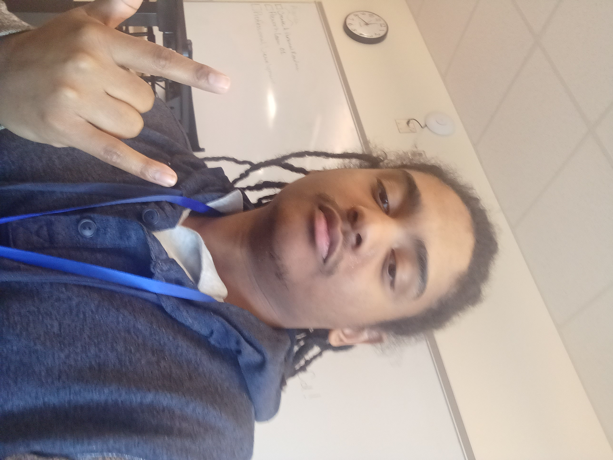

# The mundane life of John W. Bey

## Who am I?

Originally born and raised in Philly, I am simply someone looking for an opportunity in what I can only describe to be my passion. That passion is finally becoming a software enginner. Or at least,
using whatever knowledge I can gain to finally pursue the projects that I want to pursue.

## What I like

- Money. Need that in order to do anything, ESPECIALLY the things that I WANT to do.
- Pets. I want an attack dog. 
- Females. Self-explanatory.
- Computers. But only when they work. I don't want to even look at a computer when it's having personal issues.
- Lemons. This is just my weird guilty pleasure.
- Anime & video games. I probably don't watch or play the same things that most people play, but that's fine. This is definitely one of my main hobbies.

## What I hate

I hate potatoes on top of my pizza. I hate when my phone decides to act slow for no reason. I hate Twitter. I hate, HATE losing
when competing seriously. Even when I'm not competing seriously, losing just irks me the wrong way.

## What am I like?

I'm a chill person. I don't like to cause trouble for anyone that's around me. In fact, I'd like to avoid that as much as possible. I'm also disciplined when it comes to things that I really want. I don't really like to talk when I'm trying really hard to understand something, but I will help others if the need arises. Sometimes I can come off as too passive or too abrasive. It's hard to balance the two sometimes. But overall, I'm just another normal dude.

## Any controversial opinions?

- Samsung is better than iPhone.
- Comic books look ugly.
- Zendaya isn't all that.

## Contacts

You can contact me by sending an email to thebusinessonly579@gmail.com, or jbey251@gmail.com (which is simply my other work email). They are both my work email to be honest.

---

